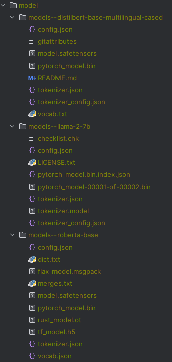

```
python main.py --device 2 --adapter lora  --dataset 20_newsgroups --n_parties 20 --alg new  --epochs 1 --comm_round 80
```

### model文件夹的结构



- 模型可从`pytorch_model.bin`、`model.safetensors`、`tf_model.h5`、`flax_model.msgpack`或`rust_model.ot`中选一个，推荐`pytorch_model.bin`。

- 由于服务器联网需要额外配置，请在本地运行：

  - ```python
    from sklearn.datasets import fetch_20newsgroups
    newsgroups_train = fetch_20newsgroups(subset='train', remove=('headers', 'footers', 'quotes'))
    newsgroups_test = fetch_20newsgroups(subset='test', remove=('headers', 'footers', 'quotes'))
    ```

  - 如果服务器联网了，可忽略此提示；

  - 并将数据集移动到服务器对应目录下，目录查看方法：

  - ```python
    # 服务器和本地方法一致
    from sklearn.datasets import get_data_home
    # 服务器大概在 /home/user/scikit_learn_data/
    # 如果没有这个文件夹，在服务器上跑一遍fetch_20newsgroups就有了
    # 文件名称是 20news-bydate_py3.pkz
    # 最终文件路径为 /home/user/scikit_learn_data/20news-bydate_py3.pkz
    data_home = get_data_home()
    ```

- 模型可选`distilbert-base-multilingual-cased`，`roberta-base`，`llama-2-7B`。

  - `llama-2-7B`的`batch_size`推荐为`8`。


### 新版本代码来袭！

- 在保留旧代码的基础上，重新写了一套代码，两套代码互不干扰；

- 新代码包括：

  - ```
    -- main_.py 主方法，注意下划线
    -- cvlc.py 与cvlc相关的方法
    -- dataset_utils.py 与数据集相关的方法
    -- fed_trainer.py 新代码进行联邦学习的类
    -- glue_utils.py glue数据集的相关方法
    -- model_utils.py 与模型相关的方法
    -- partition.py 数据划分相关的方法
    -- quantization.py 量化相关的方法
    ```

- 新代码目前支持 `20newsgroups` 、 `glue`和`xgule` 数据集，支持数据集`IID`和`Non-IID`（数量和标签）的划分；

  - `glue`包括：`sst2`, `mnli`, `cola`, `stsb`, `mrpc`, `qqp`, `qnli`, `rte`, `wnli`
  - `xgule`目前不支持标签划分，因为有些任务不是分类问题，索性一起不做，需要再说；
    - 支持`xgule`中的3种任务：
      - `SequenceClassification`：`nc`、`xnli`、`paws-x`、`qadsm`、`wpr`和`qam`；
      - `TokenClassification`：`ner`和`pos`；
      - `QuestionAnswering`：`mlqa`；
      - 注意`llama`仅支持`SequenceClassification`的部分任务，`distilbert`全支持，`roberta`大概率全支持，可能有些会有小bug；
    - 另外**不支持**文本生成的两个任务：**`qg`和`ntg`；**

- 运行：

  - ```
    CUDA_VISIBLE_DEVICES=0 python main_.py --label  --save_metric
    ```
  
- 尝试并行：

  - 首先设置并行的参数；

  - ```
    accelerate config
    ```

  - 然后会叫你回答问题，下面是我的配置，不一定要参照我，但是这个能跑；

  - ```
    - `Accelerate` default config:
            - compute_environment: LOCAL_MACHINE
            - distributed_type: MULTI_GPU
            - mixed_precision: no
            - use_cpu: False
            - debug: False
            - num_processes: 3
            - machine_rank: 0
            - num_machines: 1
            - gpu_ids: all
            - rdzv_backend: static
            - same_network: True
            - main_training_function: main
            - enable_cpu_affinity: False
            - downcast_bf16: no
            - tpu_use_cluster: False
            - tpu_use_sudo: False
            - tpu_env: []
    ```

  - 然后运行下面的命令：

  - ```
    accelerate launch main_.py  --label  --save_metric  --method cvlc
    accelerate launch --main_process_port 29501  main_.py  --label  --save_metric
    ```

- 有bug就说出来 :D:smile: